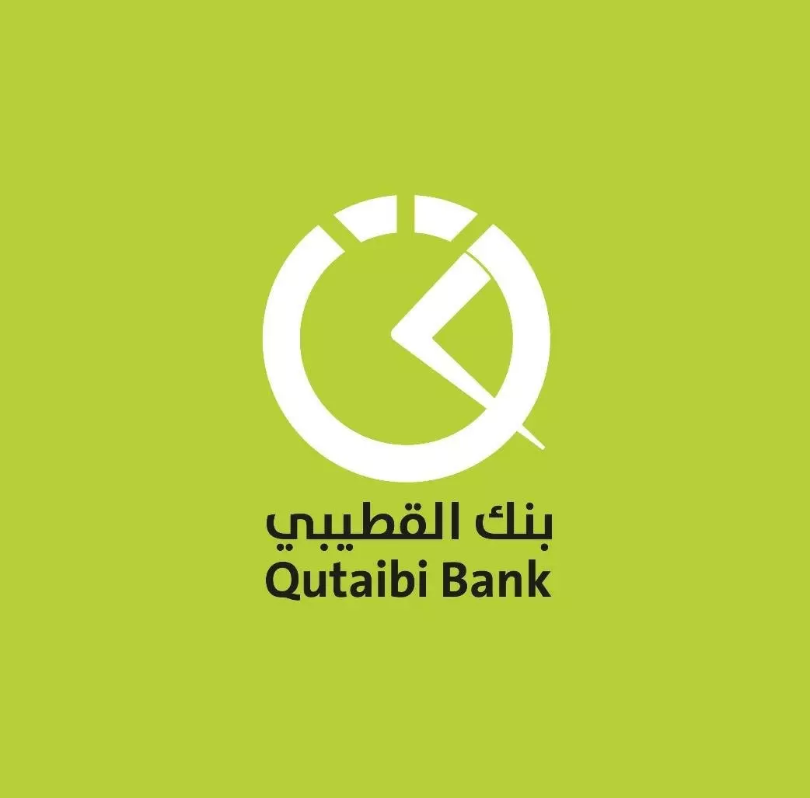

# AlQutaibiBank-payment



laravel package for AlQutaibiBank payment getway
install the package
`composer require alsharie/alqutaibibank-payment`

You can publish using the following command

`php artisan vendor:publish --provider="Alsharie\AlQutaibiBankPayment\AlQutaibiBankServiceProvider"`

When published, the `config/AlQutaibiBank.php` config file contains:

```php
return [
    'app_key' => env('AlQutaibiBank_APP_KEY'),
    'api_key' => env('AlQutaibiBank_API_KEY'),
    'payment_destnation' => env('AlQutaibiBank_PAYMENT_DESTNATION'),
    'url' => [
        'base' => env('AlQutaibiBank_BASE_URL', 'https://newdc.qtb-bank.com:5052/PayBills'),
    ]
];
```


--------------------

To purchase using AlQutaibiBank payment

### 1. RequestPayment

```php
    $alqutaibi = new AlQutaibiBank();
    $response = $alqutaibi
                ->setPaymentCustomerNo($user_phone) // TargetMSISDN
                ->setPaymentCode($payment_code)
                ->setPaymentAmount($total_payment)
                ->setPaymentCurr(1) //1 = YER
                ->RequestPayment();

    if ($response->isSuccess()) {
        $response->getTransactionID()();
        ... 
        ...
    } 
       
```

### 2. Confirm Payment

```php
    $alqutaibi = new AlQutaibiBank();
    $response = $alqutaibi
                ->setPaymentCustomerNo($user_phone)
                ->setPaymentCode($payment_code)
                ->setPaymentAmount($total_payment)
                ->setPaymentCurr(1)
                ->setPaymentOTP($otp) // customer otp
                ->confirmPayment();
                
    if ($response->isSuccess()) {
        return $response->getTransactionId();
    }
```


you can get the **request** using `$response->getRequest()` 

you can get the full **response body** using `$response->body()` for all requests